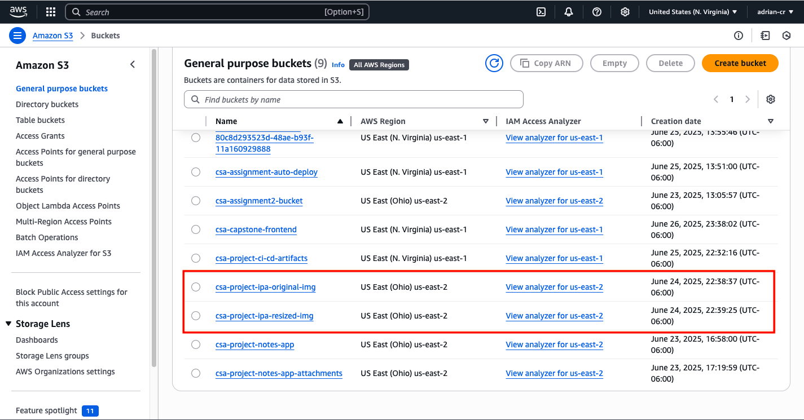
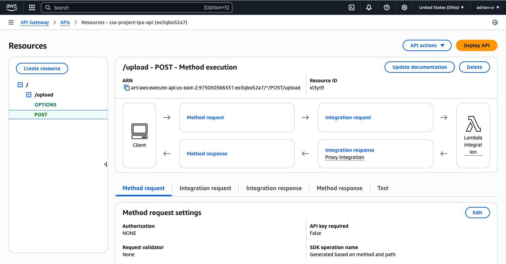

# Project: Image Processing App
In this project, I created a serverless image-processing API  for image uploading, resizing, and storage using S3 and Lambda. It accepts image files, resizes them to specified dimensions, and stores both the original and resized images in separate S3 buckets.

## Features
* Accepts image uploads via POST requests with `multipart/form-data`.
* Supports dynamic resizing based on `width` and `height` query parameters.
* Returns a direct URL to the resized image.
* Handles CORS with appropriate request headers.

## AWS Services

* `S3`: Storage for both original and resized images:




* `CloudWatch`: Logging for request processing and error tracking.

* `API Gateway`: HTTP interface for POST requests:



* `Lambda`: Serverless image processing function:
```js
import AWS from "aws-sdk";
import { v4 as uuidv4 } from "uuid";
import { parse } from "lambda-multipart-parser";
import { Jimp } from "jimp";

const s3 = new AWS.S3();
const BUCKET_ORIGINAL = "csa-project-ipa-original-img";
const BUCKET_RESIZED = "csa-project-ipa-resized-img";

export const handler = async (event) => {

  const CORS_HEADERS = {
    "Access-Control-Allow-Origin": "*",
    "Access-Control-Allow-Methods": "POST, OPTIONS",
    "Access-Control-Allow-Headers": "Content-Type",
  };

  if (event.httpMethod === "OPTIONS") {
    return {
      statusCode: 200,
      headers: CORS_HEADERS,
      body: JSON.stringify({ message: "CORS preflight OK" }),
    };
  }

  try {
    const queryParams = event.queryStringParameters || {};
    const width = parseInt(queryParams.width, 10);
    const height = parseInt(queryParams.height, 10);

    if (isNaN(width) || isNaN(height)) {
      return {
        statusCode: 400,
        headers: CORS_HEADERS,
        body: JSON.stringify({ message: "Missing or invalid width/height parameters." }),
      };
    }

    const body = JSON.parse(event.body);
    const buffer = Buffer.from(body.file, "base64");

    const fileExt = body.fileName;
    const uniqueFileName = `${uuidv4()}.${fileExt}`;

    // Upload original image
    await s3.putObject({
      Bucket: BUCKET_ORIGINAL,
      Key: `original/${uniqueFileName}`,
      Body: buffer,
      ContentType: body.contentType,
    }).promise();
    console.log("Original uploaded");

    //Resize image
    const image = await Jimp.fromBuffer(buffer);
    image.resize({w: width});
    const resizedBuffer = await image.getBuffer("image/png");

    //Upload resized image
    await s3.putObject({
      Bucket: BUCKET_RESIZED,
      Key: `resized/${uniqueFileName}`,
      Body: resizedBuffer,
      ContentType: body.contentType,
    }).promise();
    console.log("Resized uploaded");

    const resizedImageUrl = `https://${BUCKET_RESIZED}.s3.amazonaws.com/resized/${uniqueFileName}`;

    //Return URL to resized image
    return {
      statusCode: 200,
      headers: CORS_HEADERS,
      body: JSON.stringify({ resizedImageUrl }),
    };
  } catch (err) {
    console.error("Lambda error:", err);
    return {
      statusCode: 500,
      headers: CORS_HEADERS,
      body: JSON.stringify({
        message: "Internal Server Error",
        error: err.message,
        stack: err.stack
      }),
    };
  }
};

```


## How It Works
1. Client sends a `POST` request to the API Gateway endpoint with:
   * Query parameters: `width`, `height`.
   * Body: `multipart/form-data` containing the image file.
2. `Lambda` function parses and validates input.
3. Original image is saved to the `csa-project-ipa-original-bucket`.
4. Image is resized using `Jimp`.
5. Resized image is saved to the `csa-project-ipa-resized-bucket`.
6. `Lambda` function responds with a `JSON` containing the `S3` URL of the resized image.

## Test
### Request

* Request body:
    ```
    POST /upload?width=200&height=400
    Content-Type: multipart/form-data

    Body: file=<image file>
    ```
* Original image (370px * 370px):


### Response
* Response body:
  ```json
  {
    "resizedImageUrl": "https://csa-project-ipa-resized-img.s3.us-east-2.amazonaws.com/04086c8f-edb9-454f-bdca-070a3b55dfd0.png"
  }
  ```
* Resized image (200px * 400px):

